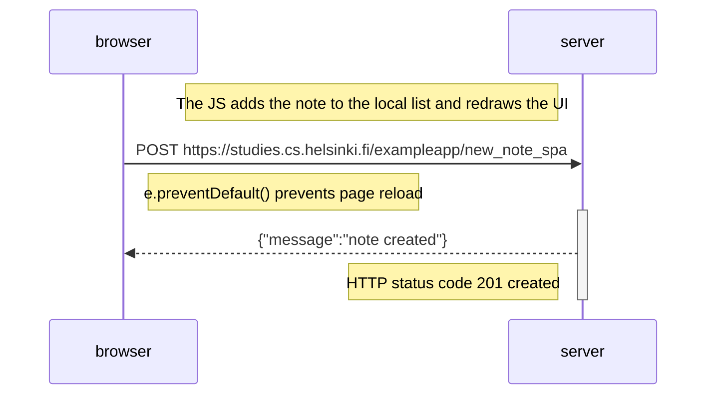

```mermaid
sequenceDiagram
participant browser
participant server

    Note left of server: The JS adds the note to the local list and redraws the UI
    browser->>server: POST https://studies.cs.helsinki.fi/exampleapp/new_note_spa
    Note right of browser: e.preventDefault() prevents page reload
    activate server
    server-->>browser: {"message":"note created"}
    Note left of server: HTTP status code 201 created
    deactivate server

```
